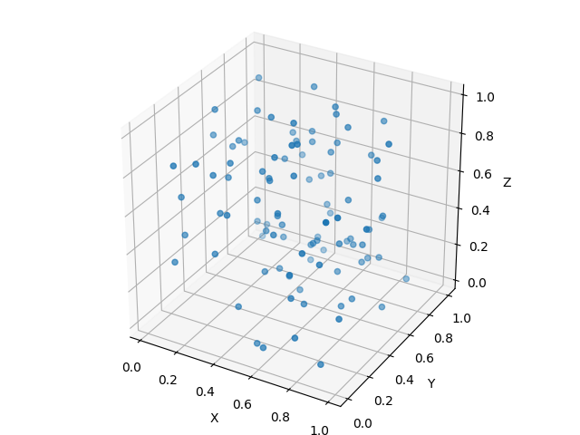
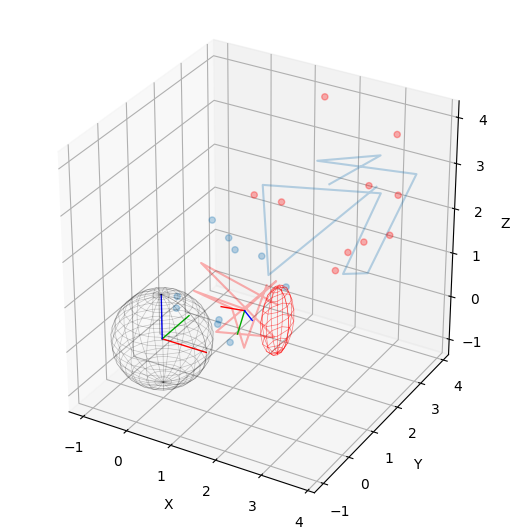

# EZ View

This is a personal lightweighted Python package to simplify the plotting of
data I normally use. It is not intended to be a general purpose package, but
rather a personal tool to make my life easier and accelerate my development.

It plots data in a simple way, with a few lines of code, and uses fewer
dependencies.

For nice article-like plots, the submodule `plot` based on `matplotlib`
includes different tools.

From simple plots:

```python
import numpy as np
import ezview as ezv

ezv.plot3(np.random.rand((100, 3)))
```



To more complex plots:

```python
import numpy as np
import ahrs
import ezview as ezv

frames = {
    '1': {
        'attitude': np.array([[1, 0, 0], [0, 1, 0], [0, 0, 1]]),
        'position': np.array([0, 0, 0])
        },
    '2': {
        'attitude': ahrs.DCM(q=ahrs.Quaternion([1., -2., 3., -4.])),
        'position': np.random.random(3)*2,
        'scale': 0.5
        }
}
ellipsoids = {
    '1': {
        'center': [0, 0, 0],
        'axes': [1, 1, 1],
        'alpha': 0.2,
        },
    '2': {
        'center': [2.0, 1.0, 0.5],
        'axes': [0.25, 0.5, 0.75],
        'color': 'r',
        'num_points' : 10
    }
}
coords = {
    '1': {
        'data': np.random.random((10, 3))*3+1,
        'alpha': 0.3,
        },
    '2': {
        'data': np.random.random((10, 3))*2,
        'alpha': 0.3,
        'color': 'r'
        }
    }
points = {
    '1': {
        'data': np.random.random((10, 3))*2,
        'alpha': 0.3,
        },
    '2': {
        'data': np.random.random((10, 3))*3+1,
        'alpha': 0.3,
        'color': 'r'
        }
    }
ezview.plot3(frames=frames, ellipsoids=ellipsoids, lines=coords, scatter=points)
```



For fast plotting of data, the submodule `qplot` based on `pyqtgraph` is used.
